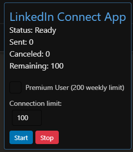

# LinkedIn Auto Connect Script

A browser bookmarklet script that automates sending connection requests to recruiters on LinkedIn with personalized messages.

## 📌 About this Repository

This repository aims to maintain updates for the script that automatically sends connection invitations to LinkedIn recruiters.

The Script is written in JavaScript and can be executed as a bookmarklet or runs in the Browser's Developer application.

## 🚀 Features

- **Personalized Messages**: Automatically sends customized connection requests with personalized notes
- **Connection Limits**: Set maximum number of connection requests to send
- **Premium User Support**: Special mode for LinkedIn Premium users with higher weekly limits
- **Progress Tracking**: Real-time counters for sent invitations and remaining quota
- **User-friendly Interface**: Clean control panel with status updates
- **Error Handling**: Detects weekly limits and handles errors gracefully

## 📋 How to Use

1. Create a new bookmark in your browser
2. Name it "LinkedIn Connect"
3. In the URL field, paste the entire script code
4. Navigate to a LinkedIn search results page with recruiters
5. Click the bookmark to activate the script
6. Configure your settings in the control panel
7. Click "Start" to begin the automation

## 🎛️ Control Panel Options

- **Connection Limit**: Set the maximum number of invitations to send
- **Premium User**: Check this if you have LinkedIn Premium (200 weekly limit)
- **Start Button**: Begin the automation process
- **Stop Button**: Pause or stop the automation
- **Status Indicators**: Track sent, canceled, and remaining invitations

## ⚠️ Important Notes

- Use this script responsibly and ethically
- LinkedIn may have rate limits or restrictions on automated actions
- Excessive connection requests may trigger account restrictions
- Customize your message to be relevant and professional
- The script works best on search results pages filtered for recruiters

## 🔄 Version History

| Version | Date       | Description |
|---------|------------|-------------|
| 1.0     | 22-03-2025 | Initial release with weekly limit detection |
| 1.1     | 15-04-2025 | Added page limit validation |
| 1.2     | 06-06-2025 | Added remaining connections counter and UI improvements |
| 1.3     | 07-06-2025 | Premium user support with double validation |

## 👨‍💻 Author

- **Fábio M Valente** - [GitHub Profile](https://github.com/fabiomvalente)

## 📄 License

This project is licensed under the MIT License - see the LICENSE file for details.
