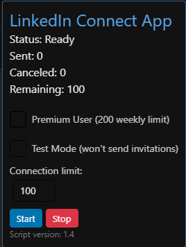

# LinkedIn Auto Connect Script

A browser bookmarklet script that automates sending connection requests to recruiters on LinkedIn with personalized messages.

## 📌 About this Repository

This repository aims to maintain updates for the script that automatically sends connection invitations to LinkedIn recruiters.

The Script is written in JavaScript and can be executed as a bookmarklet or runs in the Browser's Developer application.


## 🚀 Features

- **Personalized Messages**: Automatically sends customized connection requests with personalized notes
- **Connection Limits**: Set maximum number of connection requests to send
- **Premium User Support**: Special mode for LinkedIn Premium users with higher weekly limits
- **Progress Tracking**: Real-time counters for sent invitations and remaining quota
- **User-friendly Interface**: Clean control panel with status updates
- **Error Handling**: Detects weekly limits and handles errors gracefully

## ⚙️ Initial Setup

### 1. Configure Personal Information (REQUIRED)

**⚠️ IMPORTANT: Complete this step before using the script!**

1. **Copy the configuration template:**
   ```bash
   cp config.template.js config.js
   ```

2. **Edit `config.js` with your personal information:**
   - Replace `"Your Full Name Here"` with your actual name
   - Replace `"Your Current Position or Job Title"` with your job title
   - Replace `"Your Area of Expertise or Specialization"` with your expertise area

3. **Security Note:** The `config.js` file is automatically ignored by Git to protect your personal data.

## 📚 Documentation

- 🚀 **[Quick Guide](QUICK-GUIDE.md)** - Fast setup and usage instructions
- 🖥️ **[Console Guide](CONSOLE-GUIDE.md)** - Detailed browser console usage
- 🔧 **[Setup Guide](setup.md)** - Step-by-step initial configuration

## 📋 How to Use

**Method 1: Browser Bookmarklet**
1. Create a new bookmark in your browser
2. Name it "LinkedIn Connect"
3. In the URL field, paste the entire script code
4. Navigate to a LinkedIn search results page with recruiters
5. Click the bookmark to activate the script

**Method 2: Developer Console**
1. Navigate to a LinkedIn search results page with recruiters
2. Open Developer Tools (F12) → Console tab
3. **First step**: Copy the entire content of `config.js` file and paste in console, then press Enter
   ```javascript
   // This loads your personal configuration into browser memory
   // The config.js file contains: const LINKEDIN_CONFIG = { ... }
   ```
4. **Second step**: Copy the entire content of `Adiciona Recrutadores Avançado.js` file and paste in console, then press Enter
   ```javascript
   // This loads and executes the main script
   // The script will find your config from step 3
   ```
5. Configure your settings in the control panel that appears
6. Click "Start" to begin the automation

## 🎛️ Control Panel Options


- **Connection Limit**: Set the maximum number of invitations to send
- **Premium User**: Check this if you have LinkedIn Premium (200 weekly limit)
- **Start Button**: Begin the automation process
- **Stop Button**: Pause or stop the automation
- **Status Indicators**: Track sent, canceled, and remaining invitations

## ⚠️ Important Notes

- Use this script responsibly and ethically
- LinkedIn may have rate limits or restrictions on automated actions
- Excessive connection requests may trigger account restrictions
- Customize your message to be relevant and professional
- The script works best on search results pages filtered for recruiters

## 🔄 Version History

| Version | Date       | Description |
|---------|------------|-------------|
| 1.0     | 22-03-2025 | Initial release with weekly limit detection |
| 1.1     | 15-04-2025 | Added page limit validation |
| 1.2     | 06-06-2025 | Added remaining connections counter and UI improvements |
| 1.3     | 07-06-2025 | Premium user support with double validation |
| 1.4     | 11-07-2025 | External configuration system and security improvements |

## 🧩 Browser Extension

This project includes an extension compatible with **Chrome**, **Edge**, **Opera GX** and **Firefox** that allows you to run the script with one click:

### 🚀 Automatic Setup (Recommended)

```bash
# Run the automatic setup script
python setup-extension.py
```

The script will:
- ✅ Check all required files
- ✅ Create and configure the config.js file
- ✅ Build the extension automatically
- ✅ Create packages for all browsers
- ✅ Generate ZIP files ready for installation

### 📦 Manual Installation

📁 [See the extension folder](./linkedin-addon)

**Prerequisite**: Configure your personal information:
```bash
cd linkedin-addon/
copy config.template.js config.js
# Edit config.js with your information
```

📦 Installation by browser:
- [Chrome](./linkedin-addon/README-Chrome.md)
- [Edge](./linkedin-addon/README-Edge.md)
- [Opera GX](./linkedin-addon/README-Opera.md)
- [Firefox](./linkedin-addon/README-Firefox.md)

### 🔧 Custom Build

```bash
# Build the extension from the main script
python build-local.py
```

🖱️ After installing, just access the LinkedIn people search and click on the extension icon.

---

## 👨‍💻 Author

- **Fábio M Valente** - [GitHub Profile](https://github.com/fabiomvalente)

## 📄 License

This project is licensed under the MIT License - see the LICENSE file for details.